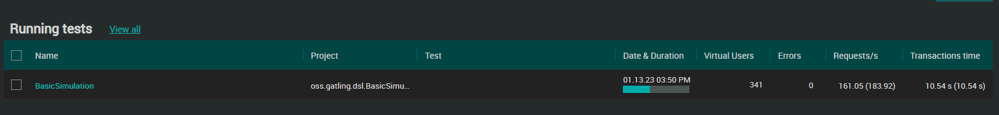
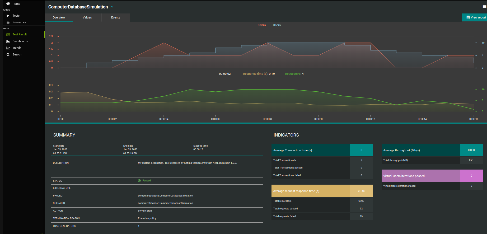
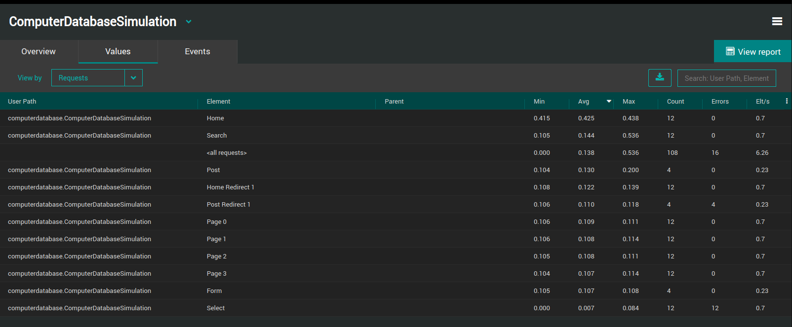
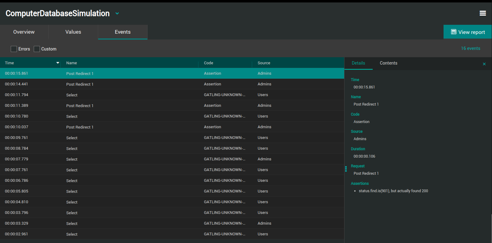
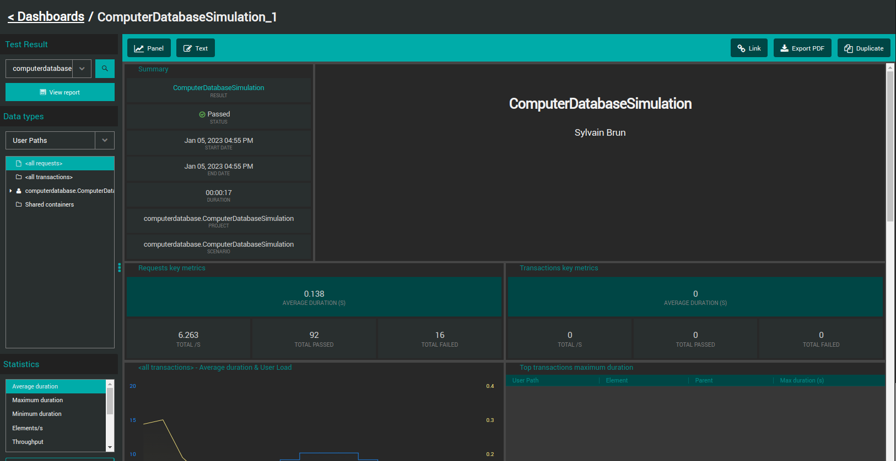
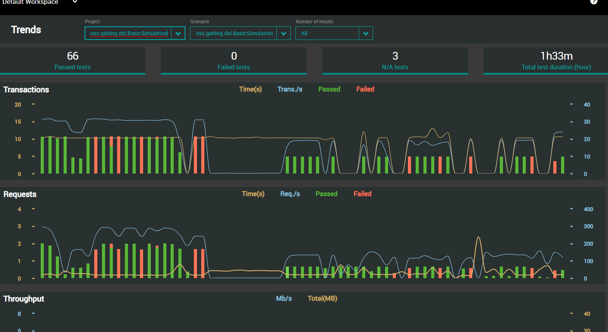

<p align="center"></p>

# Gatling
NeoLoad plugin for Gatling

## Overview

This integration is a NeoLoad plugin to be installed in the [Gatling](https://gatling.io/) environment.
It allows sending live data from the Gatling test result execution to [Tricentis NeoLoad](https://www.tricentis.com/products/performance-testing-neoload/).


| Property                       | Value                                                     |
|--------------------------------|-----------------------------------------------------------|
| Maturity                       | Experimental                                              |
| Author                         | Tricentis                                                 |
| License                        | [TODO](LICENSE)                                           |
| NeoLoad Web supported versions | SaaS platform, and onPremise from version 3.2             |
| Gatling tested versions        | Version 3.9.0                                             |
| Download releases              | See the [latest release](https://gatling.io/open-source/) |

## Installation

1. Download [latest release](https://github.com/Neotys-Labs/Gatling/releases/latest) of jar file Gatling.
2. Put it in folder plugin of the Gatling installation directory, create it if it does not exist.
3. The altered .sh and .bat files add the `plugins` dir to the classpath ahead of the original gatling classes.
`GATLING_CLASSPATH="$GATLING_HOME/plugins/*:$GATLING_HOME/lib/*:$GATLING_HOME/user-files:$GATLING_CONF:"`

## Configuration

In the ``gatling.conf`` add "nlw" to the data writers.

```yaml
  data {
    writers = [console, file, nlw]
  }

  nlw {
	  writePeriod = 1
	  url = "https://neoload-rest.saas.neotys.com"
	  token = "<your-nlw-token>"
	  workspace = "<your-workspace-id>"
	  testId = "<your-test-id>"
  }
```

* url: set the URL of the API endpoint for the NeoLoadWeb on premise deployment.
* token: User API token to authenticate to NeoLoadWeb
* workspace: the ID of the workspace to send the results to.
* testId: the ID of the test to send the results to.

## Usage

Once the Gatling test starts, a new test is create in NeoLoadWeb, as seen in the "Running Tests" section of the Home page:


## NeoLoad Web Analysis

### Test Result Overview

The Overview tab presents all basic details of the Gatling test.


More information in the [NeoLoad documentation](https://documentation.tricentis.com/neoload/nlweb/en/WebHelp/#27510.htm).

### Test Result Values
The Values tab allows sorting elements of a test quickly (Transactions and Requests).


More information in the [NeoLoad documentation](https://documentation.tricentis.com/neoload/nlweb/en/WebHelp/#24271.htm).

### Test Result Events

The Events tab displays all events occurred during the Gatling test.


More information in the [NeoLoad documentation](https://documentation.tricentis.com/neoload/nlweb/en/WebHelp/#24274.htm).

### Dashboards

The Dashboards view enables you to visualize in a very flexible layout how values evolve over Gatling test duration.


More information in the [NeoLoad documentation](https://documentation.tricentis.com/neoload/nlweb/en/WebHelp/#23448.htm).

### Trends

The Trends view makes it possible to visualize and analyze the results of a selected number of tests.


More information in the [NeoLoad documentation](https://documentation.tricentis.com/neoload/nlweb/en/WebHelp/#26401.htm).

## Troubleshooting

TODO

## ChangeLog

TODO